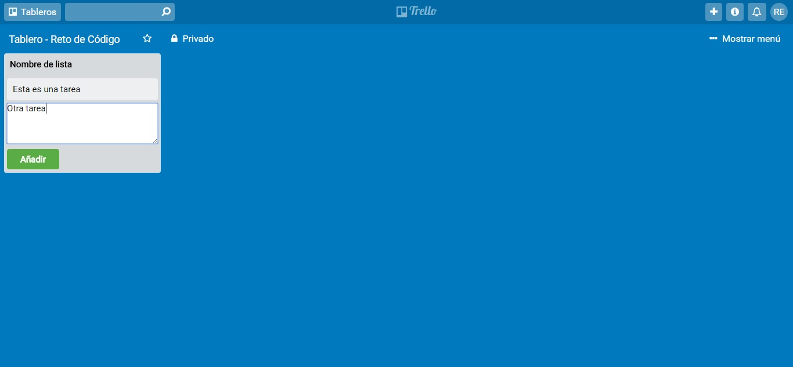

# Reto de Código - Trello #

## Objetivo

Este reto consiste en replicar el tablero de Trello, para ello se seguirá un flujo de versiones (requerimientos) que se detallan líneas abajo.

A continuación, una vista de la página:

## Versiones

#### Versión 0.0.1

1. Se mostrará el texto "Añadir una lista ...".
2. Al hacer click se debe ocultar el texto y mostrar un formulario.
3. El formulario está conformado por un input y un botón para que pueda añadir tareas a tu lista.

#### Versión 0.0.2

1. Al dar click en el botón de "Guardar", se mostrará un nuevo cuadro donde estará el nombre de la lista agregada.
2. Mostrar un texto de "Añadir una tarea" dentro de la lista.

#### Versión 0.0.3

1. Al dar click en "Añadir una tarea", deberá mostrar un formulario con un textarea y un botón que diga "Añadir".

#### Versión 0.0.4

1. Poner focus al input al dar click en "Agregar nueva tarea".
2. Al dar click en el botón de "Añadir", deberá aparecer el texto de la tarea debajo del título de la lista.

#### Versión 0.0.5

1. Mostrar el formulario nuevamente debajo de la última tarea añadida.

## Especificaciones
* El archivo index.html contiene la estructura de la página, y se enlaza con dos archivos: main.css y app.js.
* En la carpeta “css” se almacena el archivo main.css usado para dar estilo y diseño a la página.
* En la carpeta “js” se almacena el archivo app.js usado para dar funcionalidad a la página.
* En la carpeta “assets” se almacena las imagen utilizada en el Readme.md.
* En el archivo Readme.md se explica el contenido de este repositorio.
* Esta página utiliza la tipografía Roboto.
* La paleta de colores son los siguientes: #0079bf, #026aa7, #4d95bf, #7fb3d1, #006aa8, #5aac44.